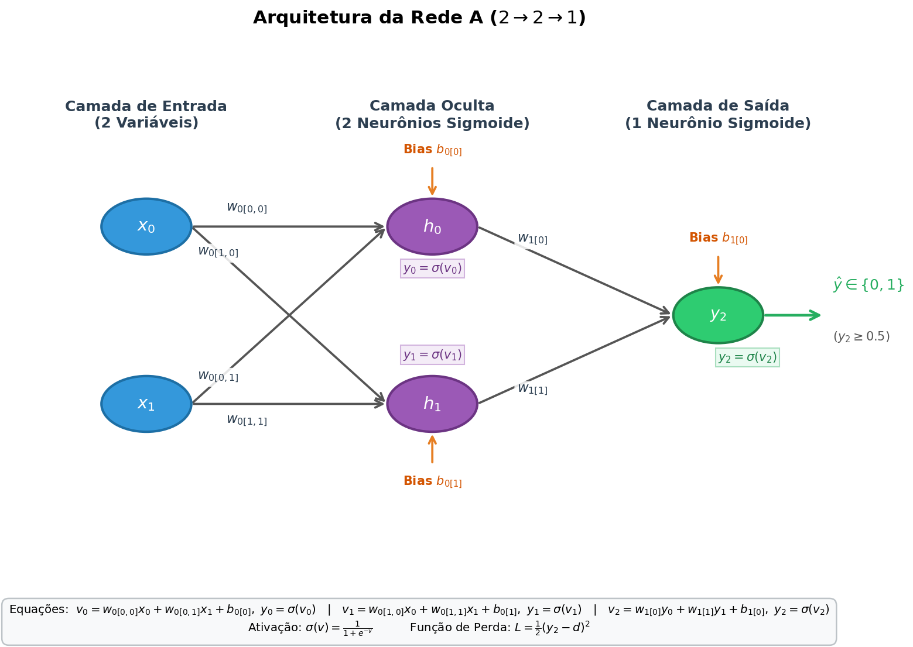
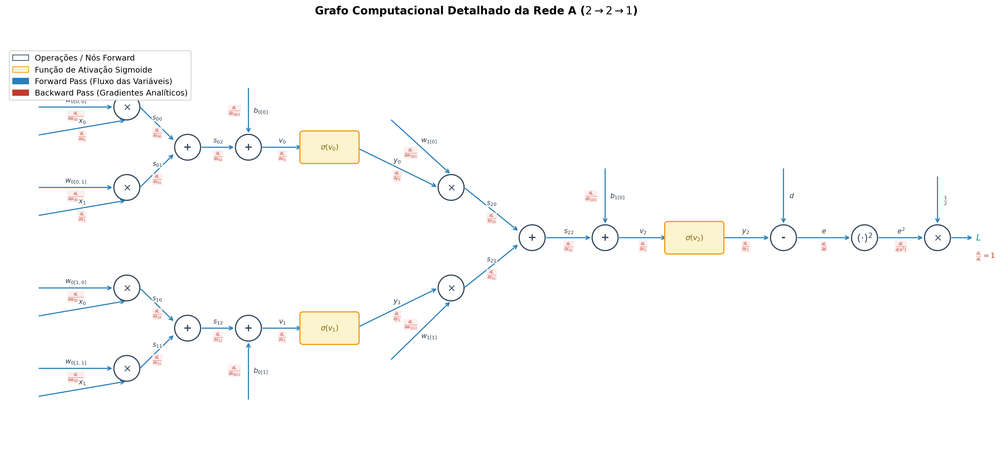
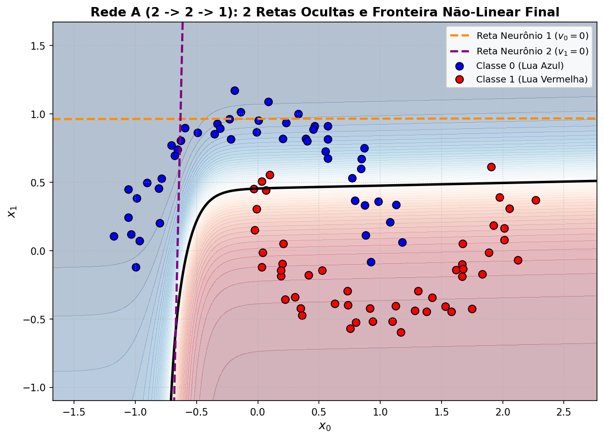
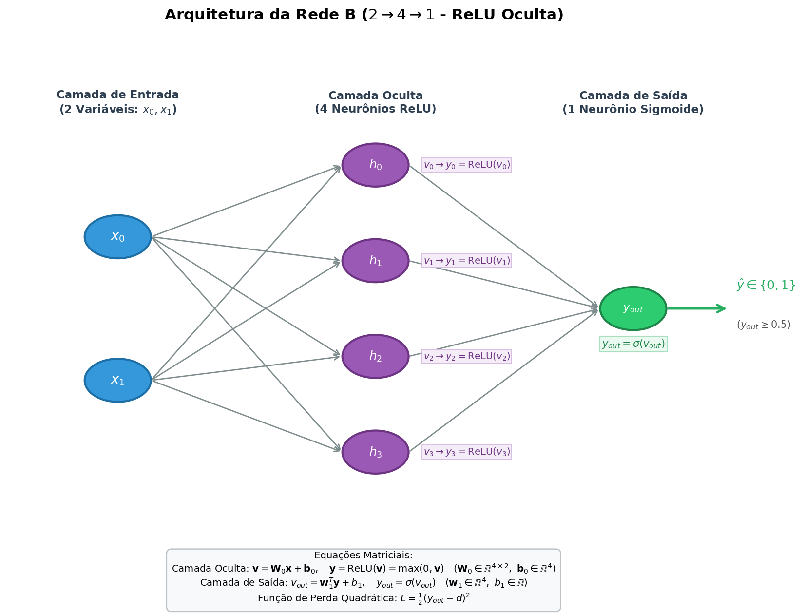
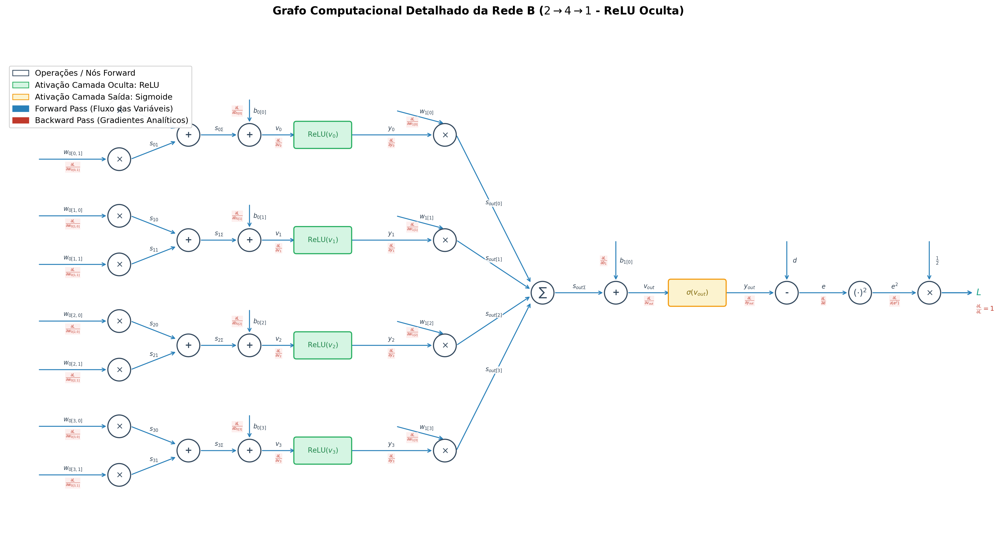
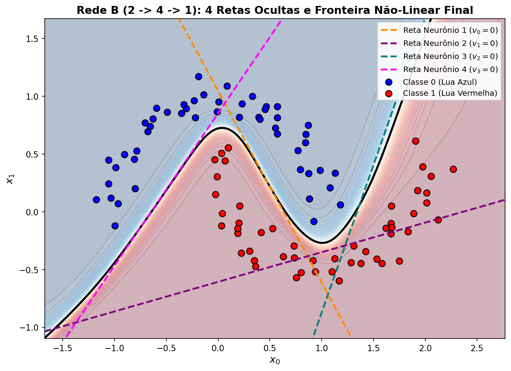

# UFPE - Matemática para Ciência de Dados: Implementação de Redes Neurais (MLP)

Projeto desenvolvido para a disciplina de **Matemática para Ciência de Dados** (UFPE). O objetivo é demonstrar a fundamentação matemática, implementação manual do algoritmo de *Backpropagation* (regra da cadeia passo a passo) e comparação determinística com o framework **Keras/TensorFlow** no problema clássico de classificação não-linear das **Duas Luas (*make_moons*)**.

O projeto conta com duas arquiteturas de rede para análise e comparação geométrica:
- **Rede A ($2 \rightarrow 2 \rightarrow 1$):** Arquitetura básica com 2 neurônios com ativação Sigmoide na camada oculta.
- **Rede B ($2 \rightarrow 4 \rightarrow 1$):** Arquitetura aprimorada com 4 neurônios com ativação ReLU na camada oculta, contornando a não-linearidade das luas e atingindo acurácia próxima a 100%.

---

## Visão Geral do Projeto

O projeto aborda a resolução do problema de classificação binária gerado via `sklearn.datasets.make_moons` (100 amostras com ruído 0.1).

Para cada arquitetura, foram desenvolvidas duas implementações:
1. **Rede Neural Manual (NumPy Puro):**
   - Cálculo explícito do *Forward Pass* e derivação analítica de todos os gradientes no *Backpropagation* usando a regra da cadeia.
   - Atualização dos pesos e biases via Gradiente Descendente.
   - Função de perda quadrática: $L = \frac{1}{2}(y - d)^2$.
2. **Rede Neural Equivalente em Keras:**
   - Implementação utilizando `keras.models.Sequential` e camadas `Dense`.
   - Inicialização com os mesmos pesos da rede manual e taxa de aprendizado equivalente para validação cruzada determinística.

---

## Estrutura Modular do Projeto

O código-fonte foi estruturado seguindo o princípio de responsabilidade única e DRY (*Don't Repeat Yourself*):

- **`src/utils.py`**: Centraliza as configurações do ambiente (supressão de logs do TensorFlow/oneDNN), importações centrais, definição das funções de ativação Sigmoide e ReLU, geração consistente do dataset e rotinas genéricas de plotagem (dataset e fronteira de decisão com as retas ocultas).
- **`src/rede_a.py`**: Contém a derivação analítica escalar passo a passo para a topologia $2 \rightarrow 2 \rightarrow 1$, seu loop de treinamento e a geração de seus diagramas de arquitetura e grafo computacional.
- **`src/rede_b.py`**: Contém a formulação matricial/vetorial para a topologia $2 \rightarrow 4 \rightarrow 1$, seu loop de treinamento e a geração de seus diagramas de arquitetura e grafo computacional.
- **`src/main.py`**: Menu interativo e orquestrador principal com opções para executar a Rede Referência (Rede A), a Rede Alterada (Rede B), ambas sequencialmente ou sair.

---

## Especificações e Comparação entre Rede A e Rede B

| Especificação | Rede A (Básica) | Rede B (Aprimorada) |
| :--- | :--- | :--- |
| **Arquivo Fonte** | `src/rede_a.py` | `src/rede_b.py` |
| **Topologia** | **$2 \rightarrow 2 \rightarrow 1$** | **$2 \rightarrow 4 \rightarrow 1$** |
| **Neurônios Ocultos** | 2 neurônios | 4 neurônios |
| **Ativação Camada Oculta** | Sigmoide | **ReLU** |
| **Ativação Camada de Saída** | Sigmoide | Sigmoide |
| **Total de Parâmetros** | 9 parâmetros | 17 parâmetros |
| **Retas de Partição Ocultas** | 2 retas no plano 2D | 4 retas no plano 2D |
| **Acurácia Final Obtida** | $\approx 85\% - 90\%$ | **100%** |
| **Convergência Keras vs. Manual** | Pesos e perda idênticos | Pesos e perda idênticos |

---

## Comparação Experimental: Implementação Manual vs. Keras/TensorFlow

Para validar a exatidão das derivadas analíticas implementadas no algoritmo de *Backpropagation*, ambas as redes foram treinadas a partir das mesmas sementes aleatórias (`seed=42`), mesmos pesos iniciais e taxas de aprendizado equivalentes.

### 1. Rede A ($2 \rightarrow 2 \rightarrow 1$) - 2 Neurônios Ocultos

| Métrica / Parâmetro | Implementação Manual (NumPy) | Validação Keras / TensorFlow |
| :--- | :--- | :--- |
| **Acurácia Inicial** | 50% | 50% |
| **Acurácia Final** | $\approx 85\% - 90\%$ | $\approx 85\% - 90\%$ |
| **Loss Final** | $\approx 5.8500$ (Soma $\frac{1}{2}e^2$) | $\approx 0.1170$ (MSE Médio) |
| **Pesos Ocultos ($w_0$)** | Matriz $2 \times 2$ | Matriz $2 \times 2$ transposta |
| **Fronteira Resultante** | 2 retas de partição linear | 2 retas de partição linear |

---

### 2. Rede B ($2 \rightarrow 4 \rightarrow 1$) - 4 Neurônios Ocultos (ReLU)

| Métrica / Parâmetro | Implementação Manual (NumPy) | Validação Keras / TensorFlow |
| :--- | :--- | :--- |
| **Acurácia Inicial** | 26% | 26% |
| **Acurácia Final** | **100%** | **100%** |
| **Loss Final** | **0.003326** (Soma $\frac{1}{2}e^2$) | **0.000067** (MSE Médio) |
| **Pesos Ocultos ($w_0$)** | Matriz $4 \times 2$ | Matriz $2 \times 4$ transposta |
| **Fronteira Resultante** | 4 retas envolvendo as luas | 4 retas envolvendo as luas |

---

## Visualizações e Resultados Gerados

Os gráficos são organizados em pastas dedicadas para cada rede:

### 1. Rede A ($2 \rightarrow 2 \rightarrow 1$) - Diretório `graphics/rede_a/`

#### Arquitetura da Rede A


#### Grafo Computacional da Rede A (Forward & Backward Pass)


#### Fronteira de Decisão e Retas da Rede A
Visualização das **2 retas lineares** dos neurônios da camada oculta ($v_0 = 0$ e $v_1 = 0$) e da fronteira resultante:


---

### 2. Rede B ($2 \rightarrow 4 \rightarrow 1$) - Diretório `graphics/rede_b/`

#### Arquitetura da Rede B


#### Grafo Computacional da Rede B (Forward & Backward Pass)


#### Fronteira de Decisão e Retas da Rede B
Visualização das **4 retas lineares** dos neurônios da camada oculta ($v_0, v_1, v_2, v_3 = 0$) envolvendo as luas com precisão superior:


---

## Estrutura de Diretórios

```text
├── graphics/
│   ├── rede_a/
│   │   ├── arquitetura_rede.png      # Diagrama da arquitetura Rede A (PNG)
│   │   ├── arquitetura_rede.svg      # Diagrama da arquitetura Rede A (SVG)
│   │   ├── grafo_computacional.png   # Grafo computacional Rede A (PNG)
│   │   ├── grafo_computacional.svg   # Grafo computacional Rede A (SVG)
│   │   ├── duas_luas.svg             # Gráfico do dataset de entrada
│   │   ├── fronteira_duas_luas.png   # Fronteira de decisão e 2 retas (PNG)
│   │   └── fronteira_duas_luas.svg   # Fronteira de decisão e 2 retas (SVG)
│   └── rede_b/
│       ├── arquitetura_rede.png      # Diagrama da arquitetura Rede B (PNG)
│       ├── arquitetura_rede.svg      # Diagrama da arquitetura Rede B (SVG)
│       ├── grafo_computacional.png   # Grafo computacional Rede B (PNG)
│       ├── grafo_computacional.svg   # Grafo computacional Rede B (SVG)
│       ├── duas_luas.svg             # Gráfico do dataset de entrada
│       ├── fronteira_duas_luas.png   # Fronteira de decisão e 4 retas (PNG)
│       └── fronteira_duas_luas.svg   # Fronteira de decisão e 4 retas (SVG)
├── src/
│   ├── main.py                       # Menu interativo principal (Rede A, Rede B, Todas e Sair)
│   ├── rede_a.py                     # Implementação e execução da Rede A (2 -> 2 -> 1)
│   ├── rede_b.py                     # Implementação e execução da Rede B (2 -> 4 -> 1)
│   └── utils.py                      # Utilitários compartilhados (dataset, ativações, plots e ambiente)
├── requirements.txt                  # Dependências do projeto (scikit-learn, numpy, matplotlib, tensorflow)
├── run.ps1                           # Script de execução automatizada para Windows (PowerShell)
├── run.bat                           # Script de execução automatizada para Windows (CMD)
├── run.sh                            # Script de execução automatizada para Linux/macOS
└── README.md                         # Documentação completa do projeto
```

---

## Pré-requisitos

- **Python 3.10 ou superior** (as versões fixadas em `requirements.txt` — scikit-learn 1.7, NumPy 2.2, Matplotlib 3.10 e TensorFlow 2.21 — não suportam Python 3.9)
- Gerenciador de pacotes `pip`

Verifique suas versões com:
```bash
python --version
pip --version
```

> **macOS:** o `python3` nativo do sistema (`/usr/bin/python3`) é a versão 3.9. Instale uma versão mais recente, por exemplo via `pyenv install 3.12 && pyenv local 3.12` ou `brew install python@3.12`, antes de criar o ambiente virtual.

---

## Como Executar

### 1. Criando e Ativando o Ambiente Virtual (`venv`)

#### Windows (PowerShell):
```powershell
python -m venv venv
.\venv\Scripts\Activate.ps1
```
*(Caso o PowerShell bloqueie a execução de scripts: `Set-ExecutionPolicy -ExecutionPolicy RemoteSigned -Scope CurrentUser`)*

#### Windows (Command Prompt):
```cmd
python -m venv venv
venv\Scripts\activate.bat
```

#### Linux / macOS:
```bash
python3 -m venv venv
source venv/bin/activate
```

---

### 2. Instalando as Dependências

Com o ambiente virtual ativado:
```bash
pip install -r requirements.txt
```

---

### 3. Executando as Aplicações

#### Execução Interativa Principal (Recomendado):
Execute o menu interativo:
```bash
python src/main.py
```
*(Ou através dos scripts de execução rápida `.\run.ps1`, `run.bat` ou `./run.sh`)*

O menu interativo apresentará as seguintes opções no terminal:
- **`[1]`**: Executa a **Rede Referência (Rede A: $2 \rightarrow 2 \rightarrow 1$)**
- **`[2]`**: Executa a **Rede Alterada (Rede B: $2 \rightarrow 4 \rightarrow 1$)**
- **`[3]`**: Executa **Todas as Redes** sequencialmente
- **`[0]`**: Encerra o programa

#### Execução Direta por Arquivo:
Também é possível rodar cada rede de forma direta e independente:
- **Rede Referência - Rede A ($2 \rightarrow 2 \rightarrow 1$):**
  ```bash
  python src/rede_a.py
  ```
- **Rede Alterada - Rede B ($2 \rightarrow 4 \rightarrow 1$):**
  ```bash
  python src/rede_b.py
  ```

---

## Autor

- **Jaquinei de Oliveira** — UFPE
