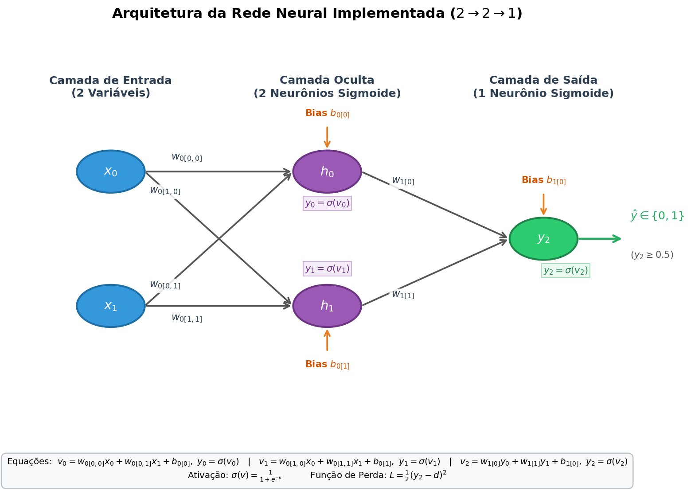
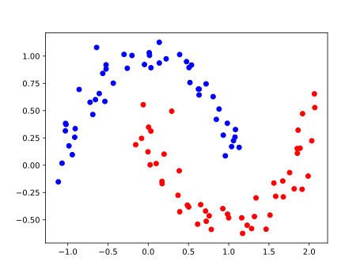
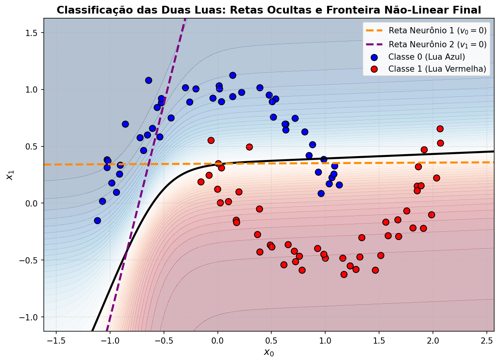

# UFPE - Matemática para Ciência de Dados: Implementação de Rede Neural (MLP)

Projeto desenvolvido para a disciplina de **Matemática para Ciência de Dados** (UFPE). O objetivo é demonstrar a fundamentação matemática, implementação manual do algoritmo de *Backpropagation* e comparação determinística com o framework **Keras/TensorFlow** no problema clássico de classificação não-linear das **Duas Luas (*make_moons*)**.

---

## Visão Geral do Projeto

O projeto aborda a resolução de um problema de classificação binária não-linearmente separável gerado via `sklearn.datasets.make_moons`. 

Para resolver o problema, foram desenvolvidas duas abordagens:
1. **Rede Neural Manual (NumPy Puro):**
   - Arquitetura $2 \rightarrow 2 \rightarrow 1$ (2 entradas, 2 neurônios ocultos com ativação Sigmoide e 1 neurônio de saída com ativação Sigmoide).
   - Cálculo explícito do *Forward Pass* e derivação analítica passo a passo do *Backpropagation* usando a regra da cadeia para atualização dos pesos e biases via Gradiente Descendente.
   - Função de perda quadrática: $L = \frac{1}{2}(y - d)^2$.
2. **Rede Neural Equivalente em Keras:**
   - Implementação da mesma topologia utilizando `keras.models.Sequential` e camadas `Dense`.
   - Inicialização com os mesmos pesos e taxa de aprendizado equivalente para validação cruzada exata dos pesos e perda calculados.

---

## Especificações e Comparação

| Especificação | Rede Manual (NumPy Puro) | Rede Framework (Keras / TensorFlow) |
| :--- | :--- | :--- |
| **Base de Dados** | Make Moons (*Duas Luas*) | Make Moons (*Duas Luas*) |
| **Arquitetura** | 2 entradas, 2 neurônios ocultos, 1 neurônio de saída (2-2-1) | 2 entradas, 2 neurônios ocultos, 1 neurônio de saída (2-2-1) |
| **Ativação Camada Oculta** | Sigmoide | Sigmoide |
| **Ativação Camada de Saída** | Sigmoide | Sigmoide |
| **Inicialização** | Aleatória uniforme com Semente 42 | Pesos iniciais copiados da rede manual |
| **Função de Perda (Loss)** | Erro Quadrático | Erro Quadrático Médio (MSE) |
| **Otimizador** | Gradiente Descendente (SGD) | Gradiente Descendente Estocástico (SGD) |
| **Épocas de Treinamento** | 10.000 épocas | 10.000 épocas |
| **Comparação dos Pesos** | Pesos finais aprendidos via Backpropagation | Pesos finais convergem exatamente para os mesmos valores |
| **Comparação de Acurácia** | Acurácia final idêntica | Acurácia final idêntica |

---

## Visualizações e Resultados Gerados

A aplicação gera automaticamente gráficos para demonstrar a distribuição dos dados, a geometria dos neurônios e a convergência da rede:

### 1. Arquitetura da Rede Neural ($2 \rightarrow 2 \rightarrow 1$)
Diagrama esquemático demonstrando os nós de entrada ($x_0, x_1$), pesos sinápticos ($w_0, w_1$), biases ($b_0, b_1$), neurônios ocultos e saída:



---

### 2. Distribuição dos Dados (*Dataset Duas Luas*)
Visualização da distribuição espacial dos pontos das duas classes geradas pelo `make_moons`:



---

### 3. Fronteira de Decisão e Retas dos Neurônios Ocultos
Visualização das **duas retas lineares** dos neurônios da camada oculta ($v_0 = 0$ e $v_1 = 0$) e da **fronteira de decisão não-linear final** obtida pela combinação na camada de saída:



---

## Estrutura do Projeto

```text
├── graphics/
│   ├── arquitetura_rede.png     # Diagrama da arquitetura da rede neural (PNG)
│   ├── arquitetura_rede.svg     # Diagrama da arquitetura da rede neural (SVG)
│   ├── duas_luas.svg            # Gráfico do dataset de entrada
│   ├── fronteira_duas_luas.png  # Gráfico da fronteira de decisão (PNG)
│   └── fronteira_duas_luas.svg  # Gráfico da fronteira de decisão (SVG)
├── src/
│   └── main.py                  # Implementação da rede manual, modelo Keras e gráficos
├── requirements.txt             # Dependências do projeto (scikit-learn, numpy, matplotlib, tensorflow)
├── run.ps1                      # Script de execução automatizada para Windows (PowerShell)
├── run.bat                      # Script de execução automatizada para Windows (CMD)
├── run.sh                       # Script de execução automatizada para Linux/macOS
└── README.md                    # Documentação do projeto
```

---

## Pré-requisitos

- **Python 3.9 ou superior**
- Gerenciador de pacotes `pip`

Verifique suas versões com:
```bash
python --version
pip --version
```

---

##  Como Executar

### 1. Criando e Ativando o Ambiente Virtual (`venv`)

#### Windows (PowerShell):
```powershell
python -m venv venv
.\venv\Scripts\Activate.ps1
```
*(Caso o PowerShell bloqueie a execução de scripts: `Set-ExecutionPolicy -ExecutionPolicy RemoteSigned -Scope CurrentUser`)*

#### Windows (Command Prompt):
```cmd
python -m venv venv
venv\Scripts\activate.bat
```

#### Linux / macOS:
```bash
python3 -m venv venv
source venv/bin/activate
```

---

### 2. Instalando as Dependências

Com o ambiente virtual ativado:
```bash
pip install -r requirements.txt
```

---

### 3. Executando a Aplicação

#### Utilizando os scripts automatizados:
- **Windows (PowerShell):** `.\run.ps1`
- **Windows (CMD):** `run.bat`
- **Linux/macOS:** `./run.sh`

#### Ou executando diretamente via Python:
```bash
python src/main.py
```

---

##  Autor

- **Jaquinei de Oliveira** — UFPE
